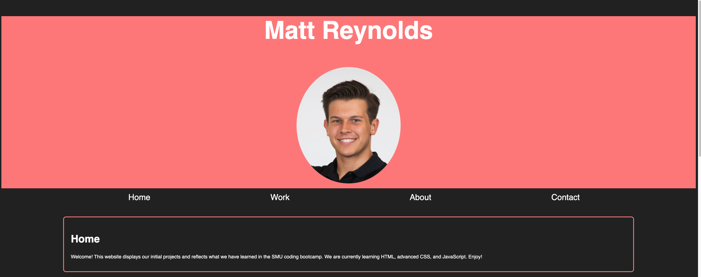
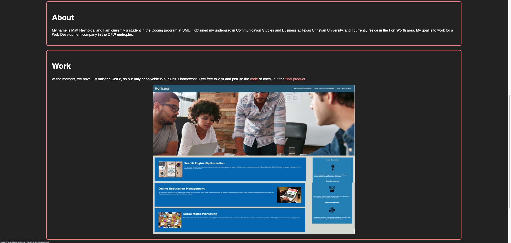
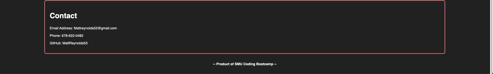
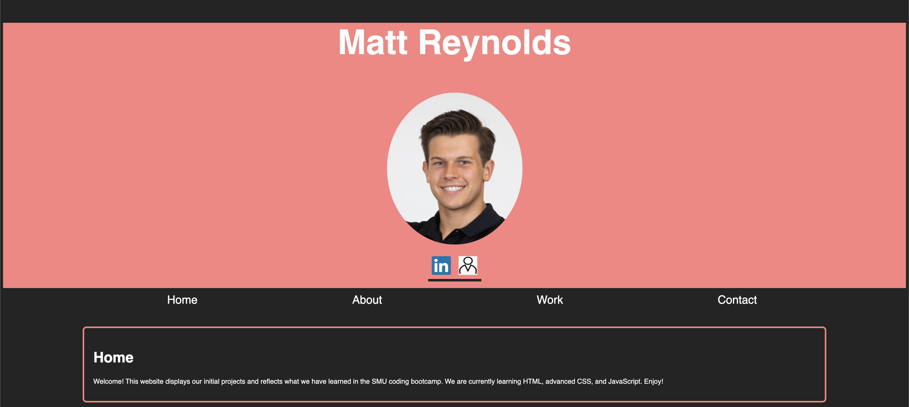
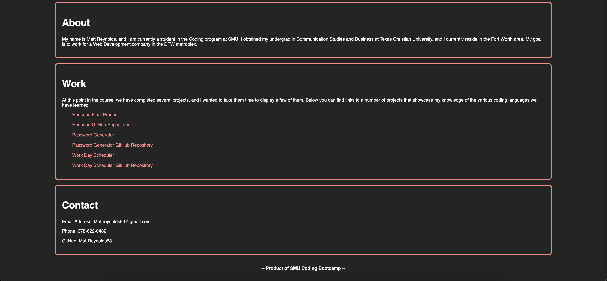

## MCR Portfolio Website


```
This repository serves to display our Unit 2 Homework and portfolio website. You will find detailed commits made in GitHub outlining the process of building this website. You can expect to find working navigation tabs beneath the header that will lead you to the respective section of the webpage. You will find cards outlining information about me as well as a display of our unit 1 homework - our only project to date other than this website. In the work card, there are hyperlinks within the text and the images leading you to the GitHub repository and final product webpage for the unit 1 Horiseon homework, respectively. Below that is my contact information in the final card on the page.
```

## Updated Portfolio November 29, 2021
```
For this updateed portfolio assignment, I kept the webpage mostly the same to minimize the possibility for bugs. In the header, I added icons the are linked to my LinkedIn Profile page and Resume pages, respectively. I chose icons to best reflect the webpage it represents to aim for a minimialist look. Additionally, I added multiple links to the Work section to direct the user to the respective project's final product page or GitHub repository. 
```

Here is the link to my Git Repository: https://github.com/MattReynolds53/MCR-Portfolio

Here is the link to the final product webpage: https://mattreynolds53.github.io/MCR-Portfolio/

Here are screenshots of my first product: 





Here are screenshots of my updated portfolio:



